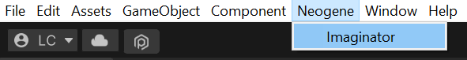
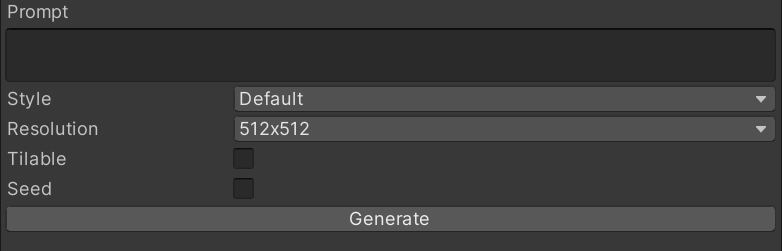
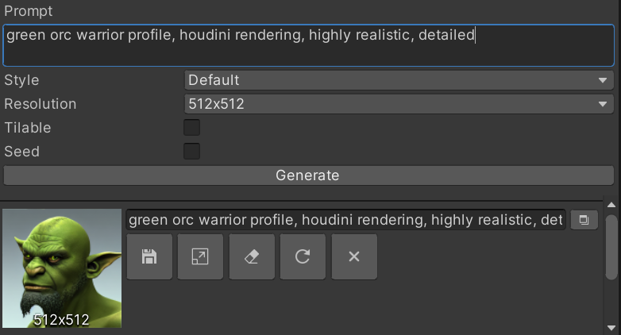
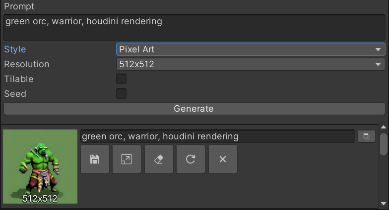
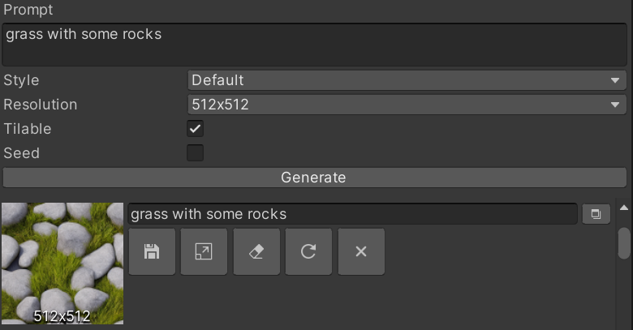

# Window
The Imaginator window can easily be opened via menu items by clicking on `Neogene` and then selecting `Imaginator`.

## Generate
The Generate section is used for generating textures with specific options.

To generate your first image, describe your image in the Prompt field.
> Note. The more detailed the description is, the more likely you will get your desired result.

Now, to generate an image, you can either click on the `Generate` button or use the shortcut `Control+Enter`.

After a bit of time, it should generate a few images!

> Note. Each generation yield unique images.

### Pixel Art Style
By changing the `Style` option to `Pixel Art`, generated images will be generated within a pixel art style.

### Tilable
Images generated with the tilable option will have a repeated pattern.

This is quite useful for creating terrain layers or texture patterns.

