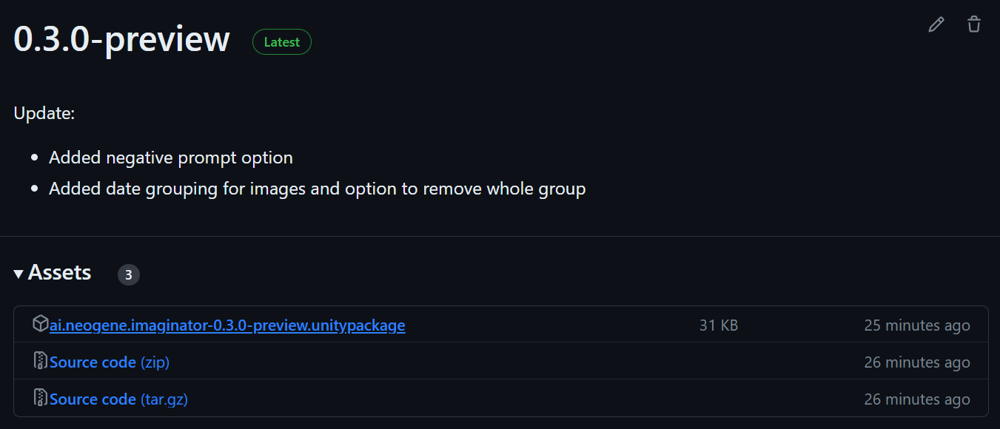
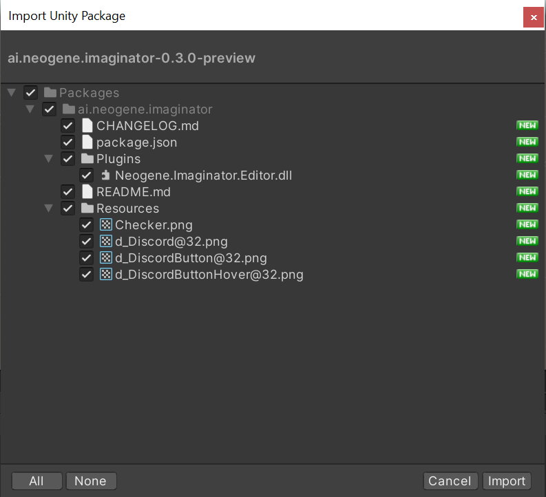
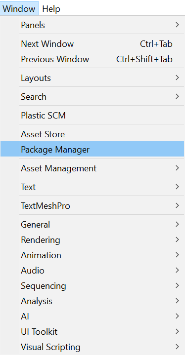
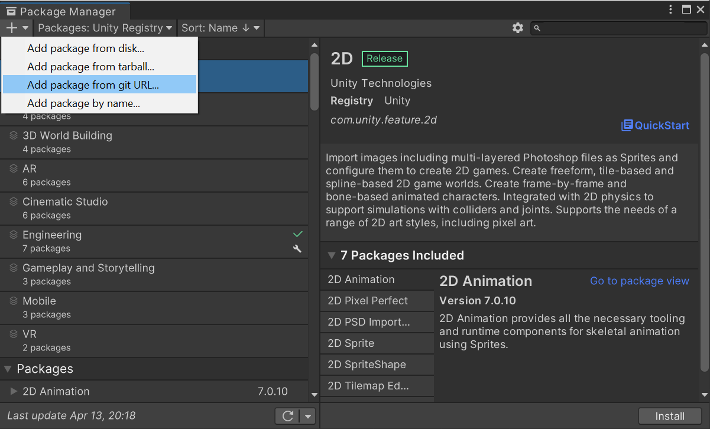
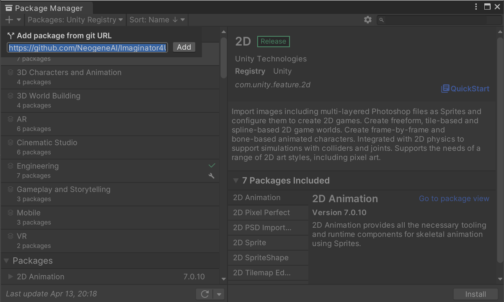
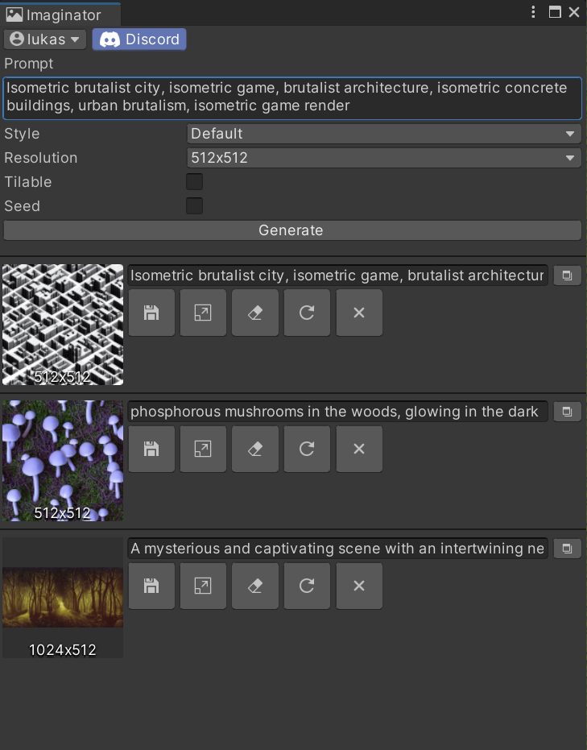

    

    
    

    

# Neogene Imaginator
The AI texture/sprite generator package for Unity is an example of a package that uses machine learning to generate high-quality textures and sprites automatically. This package can be imported into Unity projects, and its functionality can be accessed through a simple API. By leveraging AI, game developers can create stunning graphics without needing to have extensive artistic skills or resources. This package is a powerful tool that can save time and enhance the quality of Unity projects.

# Install with Unity Package
To set up the AI texture/sprite generator package in Unity, follow these steps:

1. Download the latest release of the package from the [releases page](https://github.com/NeogeneAI/Imaginator4Unity/releases).

   

2. Open your Unity project, drag and drop the downloaded package into the Unity project window, and click "Import" to import the package into your Unity project.

   

That's it! Go to section [Quick Start](#quick-start) to learn how to use the package.

# Install with Git
To set up the AI texture/sprite generator package in Unity, follow these steps:

1. Make sure you have Git installed on your computer. If you don't have Git installed, you can download it from [here](https://git-scm.com/downloads).

2. Open your Unity project and go to the Package Manager window by clicking on the `Window` menu and selecting `Package Manager`.

   

3. In the Package Manager window, click on the plus icon in the top-left corner and select `Add package from git URL.`

   

4. In the `Add package from git URL` window, paste the URL `https://github.com/NeogeneAI/Imaginator4Unity.git` and click Add.

   

> Note: [Read More...](https://docs.unity3d.com/Manual/upm-ui-git.html)

That's it! Go to section [Quick Start](#quick-start) to learn how to use the package.

# Quick Start
Here's a quick start guide for using the AI texture/sprite generator package in Unity:
- In the drop-down menu, click on `Neogene` and then `Imaginator` to open the package's image generation window.
- In the image generation window, you'll see a text box where you can write a prompt for the AI to generate an image based on your input.
- Type your prompt in the text box and click the "Generate" button to generate a new image based on your input.
- The generated image will appear in the window, and you can save it to your computer or use it in your Unity project as needed.

